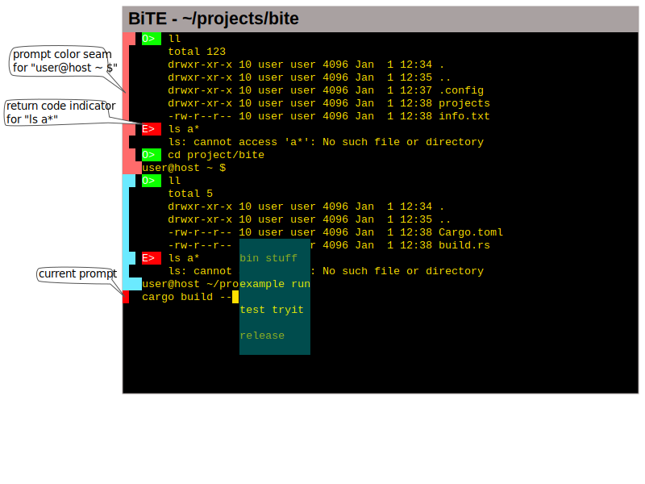

# Attention!

**This version supports a smaller set of BASH scripts than versions 0.8 and before!**

With this version, the interpreter is switched to an internal implementation
that does not use BASH to parse and execute scripts. As the interpreter is
growing, more and more capabilities will come back until the full set of
features in BASH has been implemented.

# Introduction

As a shell, e.g. bash, is required to work over slow connections and on dumb
terminals, it is naturally limited in its user interface. At the same time, a
shell is usually shown in a graphical window. However, due to the requirements
of backwards and downwards compatibility, no shell uses the full
capabilities of a graphical interface.

There are some shells, e.g. fish, that try to improve upon the state of the
art, but still limit themselves to the same simple text interface as the original
shells. There are also advanced terminal emulators, but those seem to focus on
taking over tasks of window managers, e.g. providing tiling windows.

BiTE rethinks that combination of shell and terminal emulator. It builds on
bash, probably the most frequently-used Linux shell, and on xterm, the most
feature-complete terminal emulator when it comes to control sequences.

There are several different user interaction patterns that comprise the majority
of operations in a shell:

* composing commands
* reading program output
* interacting with text-based user interfaces, e.g. text editors, interpreters
* managing background programs

Currently, terminal emulators are deficient in two areas:

* commands and command outputs are interleaved
* scroll history is limited

BiTE remedies all these shortcomings by uniting the shell and terminal emulator
part of the stack that run a command line program.

Be aware that BiTE is an experiment in User Experience rather than a
POSIX compliant shell implementation. The outcome of these experiments will
decide the future of BiTE.

## Keyboard Shortcuts

The following keyboard shortcuts trigger actions:

Shortcut            | Compose Command                          | Execute Command
--------------------|------------------------------------------|----------------
Cursor Left/Right   | Cursor Left/Right in command line        | Cursor Left/Right in input
Cursor Up/Down      | Select a different item                  | ...
Shift-Page Up/Down  | Scroll page-wise                         | Scroll page-wise.
Ctrl-Space          | Toggle output visibility of last command | Toggle output visibility of current command
Shift-Ctrl-Space    | Toggle output visibility of all commands | Toggle output visibility of all commands
Ctrl-Tab            | Switch between running background TUIs   | Switch between running background TUIs
Ctrl-R              | Open history                             | ...
Tab                 | Completion                               | ...


## Configuration

Just like bash, BiTE is configured by user-defined start script. This script is
looked for in `$HOME/.biterc` and executed as a shell script. All commands are
allowed and the execution is blocking, i.e. the GUI starts after the script is
run. Therefore, the script shouldn't perform any long-running actions.

BiTE is configured using environment variables. They do not need to be exported.

The following code lists the default values for all variables.

```
# Name of an X11 Core Font. Use xfontsel to create the name.
# If the variable is not set or the font does not exits, the default value will
# be tried.
BITE_FONT=-*-courier-medium-r-*-*-20-*-*-*-*-*-iso10646-*

# Type of presenter used for compose mode
# bubble_exclusive -- List of commands above input field, no prediction, but search.
# bubble_above -- List of commands above input field.
# markov_below -- List below input field, prediction depends on previous command.
BITE_FEAT_COMPOSE=bubble_exclusive
```

# How to build this program

Please understand this software is in a very early stage. Many features are
simply not developed. The architecture and the API of all modules are subject
to (sometimes drastic) changes from version to version.

You are welcome to try it out. This section will give you an overview on how to
download and build BiTE.

See the next section for the features currently being implemented.

## Prerequisites

* Linux (tested on an 64 bit Intel CPU)
* Rust 1.37
* Cargo 1.37
* gcc (tested on gcc-8.3)

Other systems might work too (rust supports quite a number of
systems), but have not yet been tested.

Building on **Microsoft Windows** will not work.

## Download this repository

If you read this readme on github, you should see a *clone or download* button.
Click it and follow the instructions. Alternatively, you can copy the follow
command into your terminal:

```sh
git clone https://github.com/LarsEKrueger/bite.git
```

For the following steps, it is assumed that you did that.

## Build bite

BiTE's build step consists of three sub-steps:
* Download bash
* Build bash
* Build bite

The following command performs all the steps:
```sh
cd bite
cargo build
```

It should produce a binary at `./target/debug/bite` which can be started.

If you want to install the release binary somewhere else, do this:

```sh
cargo install --root $HOME/somewhere/else
```

## Reporting bugs

I'd be grateful for any reported bug. Please navigate to [BiTE's issue
tracker](https://github.com/LarsEKrueger/bite/issues) and follow the procedure
outlined below. It will ensure that your bug can be reproduced and addressed.

* Is there a similar bug already reported? If so, add any missing specifics of
  your system / situation to the discussion.
* Create a new issue.
* Describe the difference between expected and experienced behaviour.
* Add any error or warning messages that the compilation process generated.
* If you encounter a build error, add the output of the following commands:
  ```sh
  cargo clean
  cargo build -vv
  ```
* Add your rust version (*rustc --version*).
* Add your cargo version (*cargo --version*).
* Add you gcc version (*gcc --version*).
* Add your linux version (*uname -a*). You can censor the hostname and the date of build if you like.
* Add the SHA1 of the version you checked out or downloaded.
    * If you downloaded the ZIP, run
      ```sh
      unzip -v bite-master.zip
      ```

      and report the string of numbers and letters in the second line (just above the file table).
    * If you cloned the repository, run
      ```sh
      git rev-parse HEAD
      ```

      and report it's output.
* If you can reproduce the bug, start a new instance of BiTE with tracing on:
  ```
  BITE_LOG=trace bite
  ```

  and add the log file. *Be sure to censor any personal information before posting.*

# Planned Features, Step 1

The following features are to investigated regarding their UX. The list may
change from version to version.

BiTE always shows the most appropriate view for each type of user actions. One
example is the visual grouping of commands, their outputs and the prompt under
which they were issued. This clue lets you notice quicker which operations took
place in the same folder, assuming the prompt contains the current working
directory. This feature is called *prompt color seam*.

See the following design sketch for an illustration.



In contrast to bash, bite provides a multi-line input field. Press Shift-Return
to break the current line.  In multi-line mode, both Return and Shift-Return
create more lines. This is to prevent you from accidently leaving multi-line
mode.  Use the cursor keys to navigate inside the input field. History browsing
is deactivated in multi-line mode.  In order to send the lines to bash, press
Ctrl-Return. Press Delete at the end of a line to join it with the next line.
Backspace at the beginning of a line with join it with previous one.

For composing commands, it allows quickly alternating between the list of last
commands and the outputs of those.

For reading program output, BiTE provides search and comparison capabilities
that would otherwise require additional programs like `more` or `diff`. Also,
the output can be saved to file.

BiTE also separates the regular output and error output into separate views.
They can be switched with Ctrl-Space (for the last command) and
Shift-Ctrl-Space (for all programs).

For interacting with text-based interfaces running as foreground jobs, BiTE
automatically provides a full-window view for the interface to run in.

Long-running programs (background jobs) will append their output to the log in
launch order. If programs `a`, `b`, and `c` are started, with `b` being a
background job (i.e. `b &`), the output block of `b` will grow even though `c`
came after it.  This ensures that the output of `b` is captured is a way that
it do not interfere with foreground operations.

If a background job is a text-based interface (TUI), BiTE will run and render it in a
normal interaction like a background job that is a not a TUI. Each background
TUI can be switched to with Ctrl-Tab and Shift-Ctrl-Tab.

All regular bash functionality will be implemented over time in rust.

## Lessons Learned

This section contains a list of experiences with experimental features.

### Autocompletion from History: Convenient

In case, the autocompletion makes a correct or near-correct prediction, less
effort is required to enter a command.

Using a substring-based search or even fuzzy search might further improve the UX.

### Most-frequently Command: Inconvenient

Using the number of times a command has been run isn't a good predictor of
which command will be run next. Especially when developing software, a few
commands will be called disproportionally infrequent, but usually in the same
order (e.g. `git commit` followed by `git push`).

The sequence of commands there needs to be taken into account too.

### Just pressing Return starts command from history with prediction: Inconvenient

As the Return key starts the full command even if only a part of the history
entry has been taken into the input field, using a part of the history entry is
difficult and violates the principle of least surprise.

Thus, three different options on partial matches need to be provided:

* Start the whole history entry unmodified
* Ignore the history entry and start the command in the input field as-is
* Take parts of the history entry
* Disable prediction

Options:

* The Levenshtein distance between the input and the history entries could be used.
* The `!` notation could be used/extended.
* The previous 5 commands (and possibly directories separately) could be
  displayed above the input field. Pressing the UP key on the first line of the
  input field would switch to history browsing/searching.

### Just pressing Return starts command from history with search: Convenient

The combination of explicitly opening the history, searching by typing, and
finally running the command by pressing Return is very efficient.

# Planned Features, Step 2

## Progress Information
Currently, if a program wants to offer the user information about its progress,
it can either provide this as a full-fledged GUI program (with the extended
list of dependencies that come with that approach), or it can render this
information using simple text.

BiTE will offer an interface protocol for non-GUI programs that allows it to
show the progress of the non-GUI program as another tab.

## General GUI Interactions for non-GUI Programs
In a similar fashion, BiTE will offer a way for non-GUI programs to specify a
GUI, which is then rendered by BiTE and the changes will be forwared to the
non-GUI program.

# Developer Information

* Basic design: [design.md](doc/design.md)
* Parser library: [parser.md](doc/parser.md)
* Architecture: [architecture.md](doc/architecture.md)
* XTerm compliance testing: [xterm-test.md](doc/term-test.md)

# Roadmap / Release Planning

The *0.x* versions are prototypes to gain experience with various UX concepts.

The *1.x* versions will provide an improved UX while working towards the progress/general GUI interface protocol.

* [X] 0.0.0 Basic GUI application. Get xcb working
* [X] 0.1 error handling
* [X] 0.2 Commands from history (up/down,page up/down,search)
* [X] 0.3 environment variables (read, set, pass to command)
* [X] 0.4 pipelines
* [X] 0.5 use original bash source for foreground operations
* [X] 0.6 use bash history
* [X] 0.7 Foreground TUIs
* [X] 0.8 Completion
* [X] 0.9 Display output of (non-interactive) background programs
* [X] 0.10 Make GUI font configurable
* [X] 0.11 Tabs for TUIs, incl. automatic backgrounding
* [X] 0.12 Better prediction / completion
    * [X] Predict using previous command
    * [X] Don't show last prompt in execute presenter
    * [X] History above prompt + Feature flag
    * [X] Re-add completion
    * [X] Handle completion of lower CST nodes separate from higher nodes (simple_command_completion)
    * [ ] complete updates on letters and backspace
    * [ ] complete and history react on page up/down
* [ ] 0.13 Syntax-directed navigation, completion, prediction
    * [ ] Display cursor positions for keys when ctrl is down
    * [ ] Make the command line arguments of a program fold out
* [ ] 0.14 Draw GUI using Xft
    * [ ] Adapt glyph generation from alagritty
    * [ ] Switch rendering backend (w.r.t. GUI widget support)
* [ ] 0.15 Implement all Screen Actions
    * [ ] RGB color handling
    * [ ] Implement C1 control codes
    * [ ] Implement mouse tracking sequences more cleanly
    * [ ] Handle sub parameters correctly
    * [ ] Handle query escape sequences
* [ ] 0.16 Configuration
    * [ ] Make style sheet configurable
    * [ ] Make completions configurable
    * [ ] Search .biterc according to XDG Config Spec
* [ ] 0.17 Clean up code
    * [ ] Reduce number of short-lived allocations
    * [ ] Draw using row and column iterators
    * [ ] Bug: Split reset to handle bad utf8 inside control sequences
    * [ ] Add error reporting function to Session and use it in Interpreter
    * [ ] Simplify and unify error handling
        * [ ] Check if adding session to InteractionHandle makes code simpler
    * [ ] Mapping from session to LineItems should be done in Presenter
* [ ] 1.x progress and general UI interface protocol

# TODOs
* [ ] History/Completion: Handle multi-line entries
* [ ] Complete from file system
* [ ] Use separate History in ExecuteCommandPresenter
* [ ] Session: Use previous visibility settings for repeated commands
* [ ] Place .bitehistory according to XDG Config Spec
* [ ] In Response: Use a self-compressing screen instead of lines+screen
* [ ] Bug: screen: Handle make_room for fixed_size = false correctly
* [ ] Merge history during save
* [ ] Indicate which line was entered by the user and allow them to be filtered.
    * [ ] Show Input, Output, Error in sequence, allow for filtering
* [ ] Syntax highlighting in input line
* [X] ~~Bug: Bash source $() does not work correctly~~ Cancelled. No more bash used.
* [X] Bug: `git push && git push somewhere` runs second command if first one fails
* [X] History: Use order of commands for sorting (length of look-ahead?)
* [X] History: Predict beginning of command
* [X] History: Horizontal navigation keys copy to input
* [X] Escape cancels history and completion
* [X] Make selection 1/4 window high
* [X] Unused Ctrl-Something do not add character

# Ideas
* History: Draw between prompt and input box instead of overlay
* Integrate mosh functionality
* Command line editor with vim keys (starts in insert mode)
* Syntax highlighting for output
* Image preview in ls
* Integrate auto jump functionality.
    * part of completion of `cd`
* Allow hyperlinks in output
* Draw errors / hyperlinks as QR code
* Display history / completion as Overlays
* [X] No keypress for history/completion. Pick the right overlay automatically, depending on the situation.
    * Use PgUp/Down for scrolling
* Automatically update prompt above command input (e.g. run interpreter on already-parsed string)
* Show output and errors side-by-side

# References
* utf8 input from https://gist.github.com/baines/5a49f1334281b2685af5dcae81a6fa8a
* fontset creation from https://www.debian.org/doc/manuals/intro-i18n/ch-examples.en.html
* user id checking from https://github.com/rust-lang/rust/blob/1.23.0/src/libstd/sys/unix/os.rs
* color palette: http://paletton.com/#uid=7000J0ktCwUitFfnGzUxBqFBlle
* rustc version check: https://stackoverflow.com/questions/32821998/specify-the-version-of-rustc-required-for-a-cargo-project
* Mutex around Iterator: https://www.reddit.com/r/rust/comments/7l97u0/iterator_struct_of_an_iterable_inside_a_lock_from/, https://play.rust-lang.org/?gist=083f85cd6e564b4c9abda0dbf3a33010&version=stable
